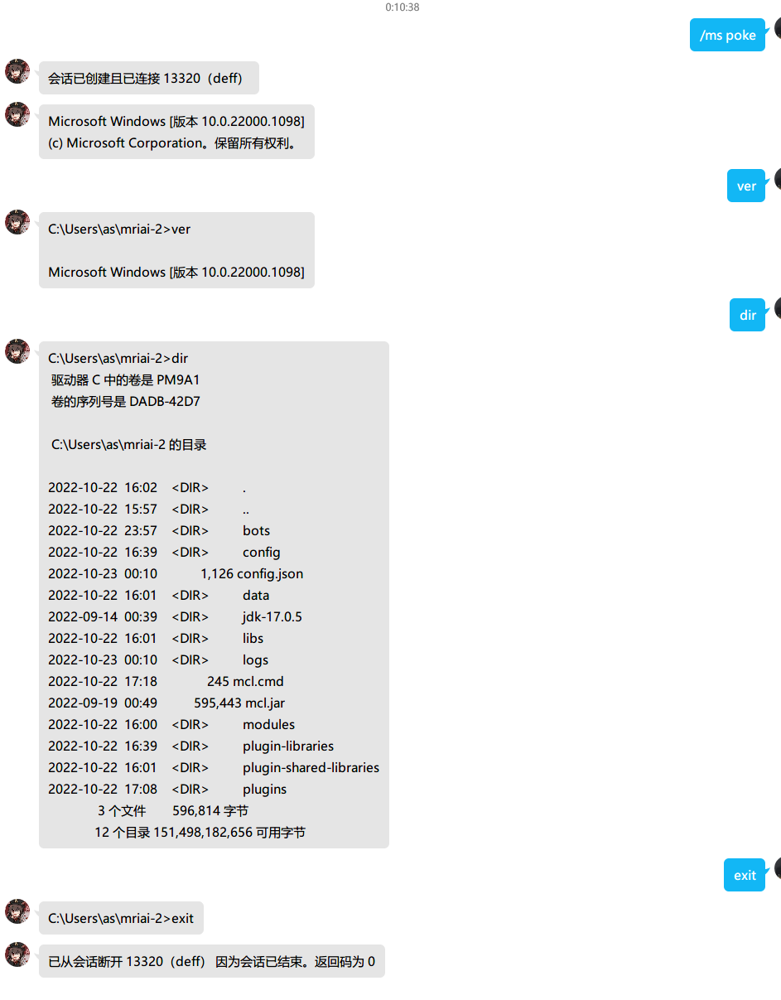

# MShell

> 一个[Mirai](https://github.com/mamoe/mirai)机器人插件，用来连接QQ聊天窗口和系统Shell

利用QQ的聊天功能，连接一个Shell窗口，然后就可以做任何事情了（其实是有限制的，具体可以[参考这里](#MShell插件的限制）)）

可以用来日常简单维护一下文件什么的，或者用Rcon管理Minecraft后台，远程打指令什么的

适合内网的机器使用，这样就不用单独设置内网穿透了

因为关闭QQ聊天窗口不会断开与服务器Shell的连接，所以你可以写个Python程序，然后用MShell做个定时提醒什么的

支持群聊会话，不再仅限于一对一的控制（2.0版本新增）



Gif图功能演示：


支持会话共享，多人之间可以分享控制权（请看下面的GIF演示)


群聊会话Gif图演示：（此功能为2.0版本新增）


## 使用前说明

因为MShell插件和系统Shell相连，权限风险远大于普通插件，如果被恶意利用，会发生更严重的后果，请严格控制权限的分配，如果在意安全问题，请打开**设备锁**等多种账号安全机制尽可能地降低安全风险

由于一些API在Mirai的抽象接口里没有提供，所以我使用了一些Java反射机制来实现某些效果。MShell插件仅对Mirai默认的内置权限管理器做了适配，如果你在使用其它权限管理插件，执行某些list相关子指令和`/mshellu`系列指令时可能后台会报错，此为正常现象，暂时无法解决。所以尽可能使用内置权限管理系统

> 整篇文档篇幅较长，请善用目录功能

## MShell插件的限制

受QQ本身的限制，MShell插件不支持全屏类应用程序，比如vim、nano编辑器和top等需要进入全屏状态的程序）

如果执意执行，则程序的每一帧画面都会被完整的发到聊天窗口中，会造成消息刷屏（如果误进入，请使用窗口抖动/戳一戳消息来切断回话），具体频率和应用程序的刷新率有关

对于进度条类非全屏应用程序，比如apt，apt-get，pip install等，因为会回显每一帧进度条的变化，如果进度条变化过快，同样也会被刷屏

基于以上使用限制，如果你仅仅是使用简单的命令行来管理服务器，比如cd，ls，mv之类的，那么MShell插件将会很顺手（或者管理mc服务器后台）

如果你需要大量编辑文本，使用top之类的程序监控硬件资源，那么请酌情使用MShell插件

## 概念

在开始使用之前，有一些很简单的概念需要明白。

### 会话（Session）

在MShell中，每一个子进程都会被封装成一个个会话进行管理，你可以粗略地认为`会话 = 子进程`。

会话同时也会负责管理子进程的标准输入输出（stdin，stdout）管道，将管道的输出通过QQ消息转发给对应的用户，同时也将QQ用户发过来的文字消息，转发到输入管道中以传递给子进程

每一个会话都有一个独一无二的的PID，有了会话的PID我们就可以对会话进行各种操作了

### 连接（Connection）

每当有人连接到一个会话上时，就会产生一个与之对应的连接，当从一个会话上断开时，这个连接也会随之失效

每一个会话都支持多人同时连接（所有人共享输入输出），但每个人同一时间只能连接到一个会话上

### 环境预设（Preset）

环境预设的作用很像Linux中的.bashrc或者.profile文件，用来初始化子程序的运行环境

环境预设包含了子程序启动所必要的东西，比如要启动子程序文件名，工作目录，环境变量等等

子程序文件名通常会被设置为`cmd.exe`、`pwsh.exe`、`bash`、`sh`等等。因为这样就可以利用这些shell程序执行一些其它命令啦（当然你也可以换成其它的程序）

### 用户（User）

这里的MShell用户指的是QQ好友，或者一个QQ群聊。但如果你和机器人不是好友关系，则不能算是用户（下文的用户均代指MShell用户）

MShell不会响应任何陌生人消息、临时会话

此外，从2.0版本开始，QQ群也会被视为一个MShell用户，这样就可以把QQ群变成一个控制台了

注意：不同机器人间的共同好友，也会被视作是同一用户

## 插件指令

MShell有5个大指令，分别是：

1. `/mshell`：负责与MShell的主要功能进行交互（指令简写`/ms`）
2. `/mshelle`：负责管理MShell的环境预设（指令简写`/mse`或者`/me`）
3. `/mshella`：负责管理MShell的权限授权（指令简写`/msa`或者`/ma`）
4. `/mshellu`：负责MShell的授权用户常规操作（指令简写`/msu`或者`/mu`）
5. `/mshellg`：负责管理MShell的群聊会话（指令简写`/msg`或者`/mg`）

参数说明：以尖括号`<>`包裹的参数为必填参数，以方括号`[]`包裹的参数为选填参数

## 基础教程

### 0.基本用法

1. 将插件放到Mirai的插件目录里，重新启动Mirai，使其加载MShell插件
2. 第一步需要在后台创建一个环境预设，可以输入下面的指令
   1. 如果是Windows：`/mse add def utf-8 cmd`
      1. 意思是：添加一个环境预设，这个预设的名字叫`def`（名字随便取，只是我喜欢叫`def`罢了）
      2. 编码为`utf-8`，如果中文乱码请尝试使用`gb2312/gbk`
      3. 要运行的程序是`cmd`，通过`cmd`，我们就可以执行其它更多的指令啦，当然也可以换成`powershell`
   2. 如果是Linux：`/mse add def utf-8 bash`
      1. 意思是：添加一个环境预设，这个预设的名字叫`def`（名字随便取，只是我喜欢叫`def`罢了）
      2. 编码为`utf-8`，Linux一般是这个，如果填其它的值我也不知道会发生什么
      3. 要运行的程序是`bash`，通过`bash`，我们就可以执行其它更多的指令啦，当然也可以换成`sh`或者`zsh`
3. 这样就创建好了一个预设，接下来我们要启动一个会话（Session）或者说启动一个Shell
4. 在启动会话之前，我们首先要给自己权限，没有权限的话，MShell可是不会理会你的消息的
5. 首先加机器人为QQ好友，MShell的指令只能在好友间使用，临时消息和群聊消息不会触发任何指令行为
6. 在后台使用`/msa add <qq号>`给自己添加权限，使自己变成能使用MShell的管理员
7. 然后我们就可以启动一个会话了，可以对机器人发送QQ消息`/ms open def `来启动一个新的会话
    1. 这里的`def`就是刚才创建的环境预设名了，意思是加载`def`这一套预设
    2. 如果`def`这个参数被省略掉了，也就是直接使用`/ms open`，则会使用默认的配置
    3. 在第一次创建环境预设时，创建的那个环境预设会被自动设为默认预设
    4. 默认配置可以用指令或者在配置文件里修改，这样就不用每次都打一遍`def`了
9. 不出意外的话机器人就会给我们返回这些消息
    1. `会话已创建(pid: 18844)`：表示会话启动成功了，并跟着会话的pid（后面会用到）
    2. `已连接到会话(pid: 18844)`：你已经成功连接到这个会话上了，接下来你发送的QQ消息就会被转发给程序了（进入透传模式了）
9. 我们可以给机器人发送`dir`（Win）或者`ls`（Linux）消息，输入好后点击发送按钮，机器人很快就会响应我们输入，然后返回给我们对应的消息
11. 用完会话之后，直接关闭聊天窗口并不能结束这个会话，而是要给机器人发送`exit`（Win或者Linux通用）消息来退出这个Shell，如果遇到卡死无法退出的情况，可以使用后面马上要提到的指令来强制结束这个会话的运行

### 1.断开和重连

直接关闭聊天窗口后，你与会话之间的连接并没有切断，再次打开聊天窗口后，还是能继续刚才的操作的

如果你想要临时切换出来，或者遇到程序卡死，无法通过`exit`正常退出的情况

只需要给机器人发送一个戳一戳消息（PC端叫窗口抖动），马上就能断开与这个会话连接，然后就可以输入其它指令新开一个会话或者强制干掉卡死的会话了

如果在断开会话之后再次使用戳一戳消息（PC端叫窗口抖动）的话，就会快速重连回刚刚断开的会话（断开期间的消息可能会漏掉一部分，这是没办法的事情）。如果此时，刚刚的会话已经结束或者退出了，也就是说没法再重连回去的话，MShell就会快速新开一个会话供你使用（以默认环境预设），相当于代替你使用`/ms open`指令一样

>  小技巧：可以一上来就对机器人使用戳一戳消息（PC端叫窗口抖动）来快速启动一个会话（这样就不用输入`/ms open`了），但是如果你想要启动非默认环境预设的话，那么还是要手动用使用指令`/ms open <preset>`来启动的。或者可以用`/mshelle def [preset] `命令来更改默认的环境预设

### 3.会话管理

断开与会话的连接并不会导致会话终止，会话会转入后台运行，你也可以随时使用消息或者指令来恢复与会话连接

如果遇到会话卡死无法使用`exit`正常退出，可以使用戳一戳消息（PC端叫窗口抖动）先断开与会话的路连接，然后使用`/ms kill <pid>`来强制结束正在运行的会话，其中pid会在断开会话的提示里中出现一次，很容易找到

每一个会话其实都是一个子进程，每一个子进程都是要占用系统资源的，所以不要接连不断地开新会话。如果不用的话，记得关掉会话

你可以使用指令`/ms list`查看当前都有哪些会话，以及会话的pid，和当前都有哪些人连接到了哪个会话上。所有的会话，不管有没有人连接，都可以使用`/ms kill <pid>`指令强行干掉

这里说一下`/ms list`指令的输出格式，比如这是一个输出

```
> ms list
[0] pid: 1652: [asforest(123456789), <Console>]
[1] pid: 8140: [ETO小组<5678901112>]
[2] pid: 20464: []
```

+ 0号会话当前有两个用户同时在连接，一个是QQ好友，一个是Mirai控制台
+ 1号会话当前有一个QQ群在连接
+ 2号会话当前没有任何人连接

```
asforest(123456789)：这种格式代表一个QQ好友，括号外面的是昵称，括号里面的是QQ号码
ETO小组<5678901112>：这种格式是QQ群聊，注意这里的括号是尖括号，和QQ好友的格式不一样
<Console>：这种格式是Mirai控制台，也就是拿控制台连接上来的，一般很少见，因为控制台用起来很麻烦
```

> 注：多个机器人（Bot）之间，会话是相互共享，没有隔离。如果你作为两个机器人（指部署到同一个Mirai进程上的两个机器人）的共同好友，那么对两个机器人发送的消息都会传入到同一个回话里，但会话传出只会从先建立连接的那个机器人好友窗口里发出。
>
> 因此尽量避免同时在多个机器人之间使用MShell插件

### 4.权限管理

MShell插件只会响应有权限的用户发来的消息，如果没有权限，是没法使用MShell插件的。MShell插件将所有的QQ好友分为3类：MShell管理员、MShell授权用户、普通用户。

+ MShell管理员可以使用MShell插件的所有指令，包括使用指令和管理指令，权限是最大的。
+ MShell授权用户只能使用部分指令，不能使用管理指令，权限是被限制的。
+ 普通用户不能使用任何指令

MShell插件的权限管理依赖于[Mirai-Console](https://github.com/mamoe/mirai-console)的权限系统，因此我们可以用Mirai-Console的权限指令去给指定用户授权使其变成管理员。虽然这样可行，但是不方便，因为要查具体的插件id和权限名。所以请尽量使用MShell插件提供的指令来完成权限管理

添加管理员：

1. 添加管理员`/msa add <qq>`
2. 移除管理员`/msa remove <qq>`
3. 查看管理员列表`/msa list`
4. 注意：上面三个子指令是用于设置管理员的，而`/msa adduser`、`/msa removeuser`、`/msa listuser`三个子指令是用来设置授权用户的，两个指令长得很像！在使用时请留意不要用错了指令！有关授权用户，请阅读下面的高级教程章节

添加授权用户：

1. 添加授权用户`/msa adduser <preset> <qq>`
2. 移除授权用户`/msa removeuser <preset> <qq>`
3. 查看授权用户列表`/msa listuser [preset]`

既不是管理员，又不是授权用户的QQ好友，被视为普通用户

---

恭喜！到这里你已经掌握了MShell插件的基本用法。你可以自由发挥用MShell插件做任何你想做的事情。也可以继续往下阅读下面章节，解锁更高级的用法。

## 高级教程

### 1.共享会话

同一个会话，可以在多个QQ用户/QQ群聊之间共享（和Linux的`screen -x`很相似）

要连接到一个已存在的会话，可以使用指令`/ms connect <pid>`，pid可以在会话创建时查看到，也可以使用`/ms list`指令查看。连接成功后，会话上的所有人会共享控制权（共享输入输出）

如果需要从当前的会话上断开（而不是结束会话），可以发送戳一戳消息（PC端叫窗口抖动）

如果要结束当前会话，可以输入`exit`或者使用`/ms kill <pid>`

> 如果你需要在[用户——QQ群]或者[QQ群——QQ群]之间共享会话，请往下阅读第四章[群聊会话](#4.群聊会话)

### 2.消息合并

应用程序的stdout一般会高频率地输出大量文字信息，如果将这些信息无差别地发送到QQ，不仅会导致网络拥挤，也会造成消息刷屏。因此MShell会把两个输出间隔较短的信息合并成一条发送

MShell的消息合并机制是这样：一个消息到达时，会有一个等待时间，如果在时间以内，又有消息过来，就会把这两个消息合并。如果很长时间没有任何消息过来，就会把当前合并好的消息一次发送出去。如果断断续续地有消息过来，则会不停合并，直到合并缓冲区满了之后，才会把所有消息一起发出去。

在这个机制中有两个参数是可配置的，一个是等待时间，一个是缓冲区大小

这两个选项分别可以在配置文件`config.yml`中配置。`batching-inteval`负责控制**等待时间**（单位：毫秒），`truncation-threshold`负责控制**缓冲区大小**（单位：字符数）

如果你的程序在运行过程中有比较频繁的stdout输出，那么请适当调大改选项的值

### 3.遗愿消息

如果会话在后台运行，而你又断开了与会话的连接，那么会话的输出就会被漏掉，你就不知道刚才程序都发送了什么。遗愿消息就是用来解决这个问题的

你在会话断开期间会漏掉会话的消息，而这些被漏掉消息的最新一部分会被保存起来，这些被保存起来的消息就叫遗愿消息

遗愿消息会在你重连回会话时之后发送给你，以告诉你当你不在的时候，当前会话最后都输出了什么，发生了什么

当然这个保存区的大小不可能无限大，所以只会记录最近（最新）的一部分消息

你可以通过下面的配置文件`config.yml`中的`lastwill-message-capacity`选项来调整这个缓冲区的大小，注意单位是字符数，不是字节

### 4.群聊会话

群聊会话是MShell插件比较高级的用法，可以将会话的输出发送到QQ群聊里，并将QQ群聊中群成员发送的消息作为输入发送给会话

注意：QQ群聊中所有的成员都能看到命令的执行结果。但只有**授权用户**和**管理员**可以执行会话输入，其它人发送的消息MShell插件不会理会，这一点安全性上无须担心

---

具体使用方法很简单，使用`/mshellg`系列指令（简写`/msg`）就可以完成

+ 如果要创建一个会话并使QQ群聊连接上去，可以对机器人执行指令`/msg open <qq群号码> [preset]`（只能私聊，群聊无效），`preset`参数是可选的，如果忽略，则使用默认环境预设，这一点和`/ms open`指令的机制是一样
+ 如果需要使QQ群聊连接到一个现有会话上，可以对机器人执行指令`/msg connect <qq群号码> <pid>`（只能私聊，群聊无效）。可以多个QQ群聊同时共享一个会话，也可以QQ群聊和QQ好友共享一个会话，更是可以支持【群、群、用户】之间共享或者【用户、用户、群】之间共享的各种多方共享玩法
+ 如果需要使QQ群从一个会话上断开连接，可以机器人执行指令`/msg disconnect <qq群号码>`（只能私聊，群聊无效）。如果需要直接终止进程，那么可以使用`/ms kill <pid>`

---

当你在使用`/mshellg`系列指令的时候，不必每次都输入完整的QQ群聊号码，你可以借助群聊号码的简写机制，在不引起歧义的情况下，只输入部分群聊号码来替代输入完整的群聊号码。此简写机制对整个`/mshellg`系列指令都是适用的

比如我要操作的QQ群号码是123456789，你可以直接使用12345来代替完整的QQ群号码，剩下的部分MShell会帮你自动补全，比如`/msg open 12345`和`/msg open 123456789`效果是一样的

你可以更进一步，直接使用123，甚至12，甚至只有一个1！来代替完整的QQ群号码，这样是不是就方便了许多呢？（我在上面的Gif图里演示的时候，就是直接使用的一个3，因为我的机器人群列表里只有一个以3开头的QQ群）

但如果你有两个QQ群，一个是12340000，一个是12350000，那么你就不能只写123，因为这两个QQ群号码的前三位都是一样的，会引起歧义。此时需要至少4位数来确定具体的QQ群，比如1235用来指定后面的群聊。1234用来指定前面的群聊

### 5.授权用户管理

除了管理员以外，还有授权用户可以使用MShell插件，虽然可以使用，但权限是受限的，只能使用常规指令，无法使用管理指令

授权用户的授权是针对单个环境预设的，你可以给不同的授权用户以不同的环境预设使用权，比如A用户只能使用环境预设A，B用户只能使用环境预设B，C用户可以同时使用环境预设A、B。具体的授权可以自由组合

当授权用户没有对应环境预设的权限时，也就无法创建、连接、结束对应的环境预设/会话

你可以使用`/mshella`指令的`adduser`、`removeuser`、`listuser`指令（注意不是管理员设置指令：`/mshella add/remove/list`，两个指令长得很像，但功能不一样，请注意区分不要用错了）

+ 授权一个用户使用某个环境预设：`/mshella adduser <preset> <qqnumber>`
+ 取消一个用户的环境预设授权：`/mshella removeuser <preset> <qqnumber>`
+ 查看所有的授权用户：`/mshella listuser [preset]`，如果`preset`省略则查看所有的环境预设

如果你要授权用户123456可以使用环境预设abc，那么就输入`/mshella adduser abc 123456`

之后，用户123456就可以使用授权用户专用的`/mshellu`系列指令来完成创建会话，连接会话等操作了（授权用户同样支持发送戳一戳消息（PC端叫窗口抖动））

如果在指令`/mshella adduser <preset> <qqnumber>`中，`<qqnumber>`为0，那么表示任何人都能对此环境预设开启的会话进行输入。但是这个Anyone机制只对群聊会话有效，对私聊会话是无效的。这样任何群成员都可以在群里使用你的Shell，但私聊机器人却不行

`/mshellu`系列指令不同于主指令`/mshell`，`/mshellu`系列指令的权限是被限制的，只能对有权限的环境预设进行操作，不能操作其它无权限的环境预设。但主指令`/mshell`可以操作所有环境预设，拥有最大的权限

---

授权用户可用的指令有这些：

1. `/mshellu open [preset]`：创建并连接到一个会话，具体用法同主指令`/mshell`对应子指令
2. `/mshellu write <pid> <newline> [text]`：向当前连接的会话里输入内容但不换行，具体用法同主指令`/mshell`对应子指令
3. `/mshellu kill <pid>`强制结束一个会话，具体用法同主指令`/mshell`对应子指令
4. `/mshellu connect <pid>`：连接到一个会话，具体用法同主指令`/mshell`对应子指令
5. `/mshellu list`：显示所有会话，具体用法同主指令`/mshell`对应子指令
6. `/mshellu presets`：列出所有可用的环境预设

## 选阅教程

选阅教程用的很少，如果你感兴趣，可以有选择地看一看

### 1.会话输入前缀

默认配置下，当你连接到一个会话上时，你的发出去的所有消息都会被视为会话的输入给发送到stdin（透传）

有时你可能不想这样，你想有选择性地发送一部分消息到会话的输入，另一部分则作为普通聊天内容，不做任何处理。某些情况下，比如使用群聊会话时可能需要这样的设置。

你可以添加一个识别前缀，当在聊天消息中识别到这个前缀时，就会被发送到stdin，但没有识别到这个前缀时，不做任何处理

你可以在配置文件`config.yml`中修改`session-input-prefix`选项来调整这个前缀。

如果选项为空，那么你在连接到一个会话上之后，你的任何消息都会被作为会话的输入发送到会话。

如果这个选项不为空，那么你在连接到一个会话上之后，只有以这个前缀开头的QQ消息，才会被作为会话的输入发送到会话。

比如将`session-input-prefix`选项设置为一个减号`session-input-prefix: '-'`

之后你就可以使用`-/ms`来单独向会话发送消息（实际发送过去的是`/ms`，减号是前缀，会被去掉）

而不会触发mirai的`/ms`指令解析

一般情况下如果没有指令冲突，可以给这个选项留空来禁用

### 2.用指令发送消息

你可以使用命令强制往一个会话里输入文字，即使你没有连接到那个会话上也是可以的。

只需要使用`/ms write <pid> <newline> [text]`就可以了。`<newline>`参数的取值只能是`true/false`，表示是否在`[text]`后面跟上一个换行符`\n`，一般情况下都是`true`。`[text]`参数就是你要发送的消息

如果仅仅想发送一个换行符，可以使用`/ms write <pid> true`，即把`[text]`参数省略

### 3.控制台用户

除了普通QQ用户可以连接/创建会话以外，Mirai控制台也可以做到。但Mirai控制台使用起来终究不是特别方便，一般只是特殊情况下才会使用

具体使用方式和普通用户一样，使用`/ms open [preset]`来创建，`/ms connect [pid]`来连接等等

当连接上以后，要使用`/ms write <pid> <true/false> <text>`来往会话里进行输入，具体参数的用法请参考**用指令发送消息**章节

##  指令参考

### 0.主指令（/mshell）

主指令用于实现与MShell插件的大部分管理操作

```bash
# 连接到一个会话，会话使用pid指定
/mshell connect <pid>

# 断开当前会话
/mshell disconnect

# 强制断开一个会话的所有连接
/mshell disconnect <pid>

# 强制结束一个会话
/mshell kill <pid>

# 显示所有会话，输出格式：
# [0] pid: 4432: [四月浅森(123456789)]
# 0是编号不用管；4432是pid；后面括号里是当前连接的用户列表
/mshell list    

# 开启一个会话并立即连接上去
# 如果preset被省略了，则使用默认的环境预设（默认预设可以修改）
# 否则使用指定的环境预设
/mshell open [preset]

# 向目标会话stdin里输出内容（但不换行）
# newline只能是true/false，表示text的末尾是否跟上一个换行符\n
/mshell write <pid> <newline> [text]

# 模拟戳一戳(窗口抖动)消息，主要给是电脑端调试使用，因为电脑端发送窗口抖动消息有较长的冷却时间
/mshell poke

# 重新加载config.yml
/mshell reload
```

### 1.环境预设指令（/mshelle）

环境预设指令用于配置环境预设

注意：所有路径分隔符均使用正斜线，不要使用反斜线

```bash
# 创建一个环境预设
# preset: 预设的名字
# charset: 字符集（Win选择gbk或者gb2312，Linux选择utf-8）
# shell：具体启动的子程序，一般是cmd.exe或者bash、sh
/mshelle add <preset> <charset> <shell>

# 设置一个环境的编码方式
# 如果charset被省略，charset就会被清空
# 清空后这个环境就不能正常启动了，需要重新设置一次charset才行
/mshelle charset <preset> [charset]

# 设置环境的工作目录
# 工作目录可以保持默认的空状态
# 如果为空，工作目录默认就是mirai的目录
/mshelle cwd <preset> [cwd]

# 切换默认的环境预设方案
# 如果preset被省略，就会输出当前使用的默认环境预设名
# 如果preset没有省略，就会设置默认环境预设名（preset必须是已存在的预设）
/mshelle def [preset]

# 设置环境的环境变量
# 如果key被省略，会输出整个env的值
# 如果value被省略，则会删除对应的key-value
/mshelle env <preset> [key] [value]

# 设置环境的初始化命令
# exec是一个指令或者说一个预先设置好的文字
# shell启动之后，就会立即发送给shell的stdin
# 可以在会话启动后自动执行某些程序什么的
# 如果exec被省略，则会禁用这个功能
/mshelle exec <preset> [exec]

# 设置会话(子进程)的入口程序(一般是shell程序)
# 如果shell被省略，shell就会被清空
# 清空后这个环境就不能正常启动了，需要重新设置一次shell才行
/mshelle shell <preset> [shell]

# 将会话为单实例会话，默认为false
# 设置为单实例会话后，后创建的会话会直接连接到第一个会话上
# 对于同一个环境预设来说，永远只会有一个会话对象
/mshelle singleins <preset> <true/false>

# 设置会话PTY的宽度，默认为80
/mshelle columns <preset> <columns>

# 设置会话PTY的高度，默认为25
/mshelle rows <preset> <rows>

# 列出所有环境预设配置
# 列出当前都有哪些环境预设方案
# 如果preset被省略，会显示所有环境预设方案
# 如果preset没被省略，会显示预设名中包含preset的所有方案（可以理解为搜索）
/mshelle list [preset]

# 设置会话的stdout合并间隔，单位：毫秒
/mshellp batch <preset> <inteval-in-ms>

# 设置会话的stdout合并上限，单位：字符数
/mshellp truncation <preset> <threshold-in-chars>

# 设置会话的遗愿消息缓冲区大小，单位是字符数
/mshellp lastwill <preset> <capacity-in-chars>

# 从配置文件重新加载环境预设方案
# 如果你手动改了配置文件presets.yml，可以使用这个指令来强制重载
# 一般不建议直接改配置文件，很容易出错
/mshelle reload

# 删除一个环境预设
/mshelle remove <preset>
```

### 3.权限管理指令（mshella）

权限管理指令用来添加删除管理员和授权用户的

```bash
# 添加管理员
/mshella add <qqnumber>

# 列出所有管理员
/mshella list

# 删除管理员
/mshella remove <qqnumber>

# 添加授权用户
/mshella adduser <qqnumber>

# 列出所有授权用户
/mshella listuser

# 删除授权用户
/mshella removeuser <qqnumber>
```

所有有`com.github.asforest.mshell:all`权限的用户，都被视为是管理员。因为手动给权限比较麻烦，建议使用`/mshella`及其子指令来替代这一操作

同时所有拥有`com.github.asforest.mshell:preset.<preset_name>`和`com.github.asforest.mshell:use`权限的用户都被视为是授权用户，其中`<preset_name>`是具体授权的环境预设名

>  拥有`*:*`（根权限）或者`com.github.asforest.mshell:*`（MShell插件的根权限）的用户也能够使用MShell插件的，但同时不会显示在管理员列表里！（`/mshella list`）

### 4.授权用户指令（/mshellu）

授权用户指令是授权用户的专属指令，只包括了主指令`/mshell`的一小部分操作。

主指令`/mshell`和授权用户指令`/mshellu`有很多功能完全相同的子指令，如果你是管理员，尽量使用主指令`/mshell`操作（虽然你用授权用户指令`/mshellu`也没什么问题）， 如果你不是管理员但是是授权用户，那么可以用授权用户指令`/mshellu`操作

```bash
# 创建并连接到一个会话，但只能创建有对应权限的环境预设
# 具体用法同主指令/mshell对应子指令
/mshellu open [preset]

# 向当前连接的会话里输入内容但不换行
# 具体用法同主指令/mshell对应子指令
/mshellu write <newline> [text]

# 强制结束一个会话，但只能强制结束有对应权限的会话
# 具体用法同主指令/mshell对应子指令
/mshellu kill <pid>

# 连接到一个会话，但只能连接到有对应权限的会话
# 具体用法同主指令`/mshell`对应子指令
/mshellu connect <pid>

# 显示所有会话，只会列出所有有权限会话
# 具体用法同主指令`/mshell`对应子指令
/mshellu list

# 列出所有可用(有权限)的环境预设
/mshellu presets
```

### 5.群聊会话指令（/mshellg）

群聊会话指令就是用来进行群聊会话的一些操作的指令

```bash
# 创建一个新的会话，并将指定的QQ群聊立即连接上去
# 如果preset被省略了，则使用默认的环境预设，否则使用指定的环境预设
/mshellg open <qq_group_number> [preset]

# 断开一个QQ群聊与其会话的连接
/mshellg disconnect

# 使一个QQ群聊连接到一个会话上
/mshellg connect <QQ群号> <pid>
```

所有群聊会话相关的指令只能给机器人发私聊才有效，直接发送到群里是没有任何作用的

## 配置文件参考

### presets.yml

`presets.yml`是保存着环境预设方案的配置文件，一般不建议手动修改，因为很容易出错，建议使用`/mse`系列指令来完成修改

如果一定要手动修改，可以在修改完成后，使用`/mse reload`来立即重新加载

### config.yml

`config.yml`是保存着一些MShell设置信息的文件，可以在修改完成后，使用`/ms reload`来立即重新加载。`session-input-prefix`选项会立即生效

此文件一般不需要修改，各项属性保持默认就好

```yaml
# 会话输入前缀
session-input-prefix: ''
```
